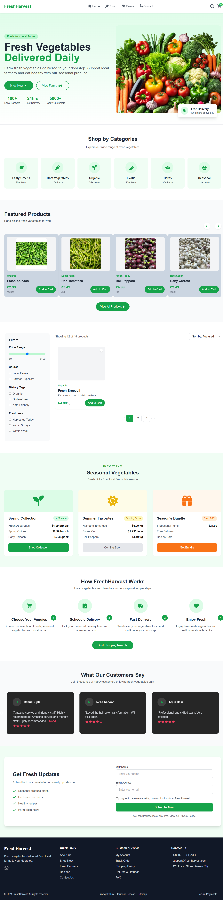

# 🌐 Next.js Starter Project

> A modern, fast, and SEO-friendly web application built using [Next.js](https://nextjs.org/).  
> This project was bootstrapped with [`create-next-app`](https://github.com/vercel/next.js/tree/canary/packages/create-next-app).

---

## 📸 Project Preview

Here’s an overview of the key features and functionalities showcased through screenshots.

### 🧊 Freeze View
Displays the “Freeze” feature where data or UI elements are temporarily locked for better visibility and editing control.



---

## 🛠️ Tech Stack

- **Framework:** [Next.js 14+](https://nextjs.org/)
- **Language:** JavaScript / TypeScript
- **Styling:** Tailwind CSS / CSS Modules
- **Deployment:** [Vercel](https://vercel.com)
- **Version Control:** Git & GitHub

---

## ⚙️ Getting Started

Follow these steps to run the project locally 👇

### 1️⃣ Clone the Repository
```bash
git clone https://github.com/yourusername/your-repo-name.git
cd your-repo-name
npm install
npm run dev
